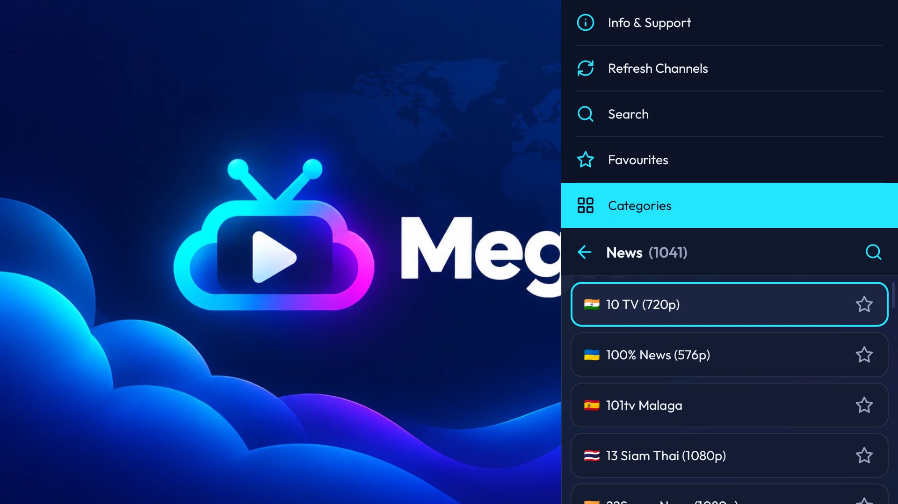
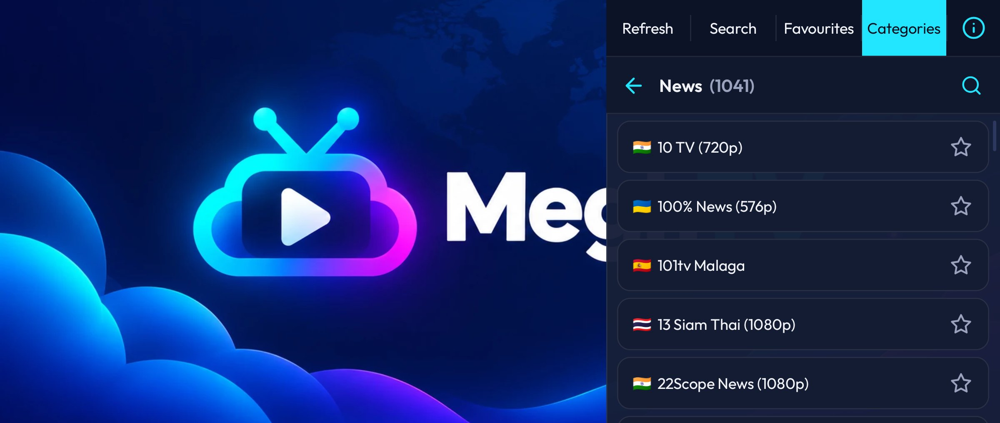

<p align="center">
  
</p>

| Android TV | Phone |
| --- | --- |
|  |  |

# MeghTV


An Android TV and phone app for watching live TV channels, most of them listed by [iptv-org](https://github.com/iptv-org).

MeghTV is free to use and has no ads. If you find it useful, you can support its development to help keep it that way.

[](https://ko-fi.com/Z5Z8281UOM)

## Features

- Runs on Android TV (remote control) and Android phones (touch, landscape).
- Channels browsed by category or country, with search and favourites stored on the device.
- Channels that failed to play are marked. Any channel can be deleted; a full refresh brings deleted channels back.
- Plays HLS, DASH, SmoothStreaming and RTSP streams, and tries a channel's other stream URLs when one fails. A channel's source can also be picked by hand; the pick is played first from then on.
- Picture quality, subtitles and audio track can be picked when a stream offers more than one.
- A paused channel resumes where it was paused; "Go live" (or Right / fast-forward on a TV remote) jumps back to the live picture.
- Checks for a new channel list at launch and offers to update; "Refresh Channels" in the menu checks on demand.

## Building locally

Command-line only, no Android Studio required.

```bash
./gradlew assembleDebug     # debug build
./gradlew assembleRelease   # release build (R8 shrinking on, unsigned)
```

To build and sign a release APK the same way CI does, without needing to push anything:

```bash
scripts/build-local-release.sh
```

This needs the release keystore + its passwords available locally (kept outside the repo — never commit a keystore). See the script for how to point it at a different location if needed.

## Releasing

Bump `versionName` and `versionCode` in `app/build.gradle.kts` and rewrite `RELEASE_NOTES.md` for the new version in the same PR (CI fails a version bump without it). On merge, a signed APK is published as a GitHub Release with those notes, but only if `versionName` increased.

## License

The source is available under the [PolyForm Strict License 1.0.0](LICENSE.md): you may read, build and run it for non-commercial purposes, but not distribute it or make modified versions. The MeghTV name and logo are not covered by the license.
